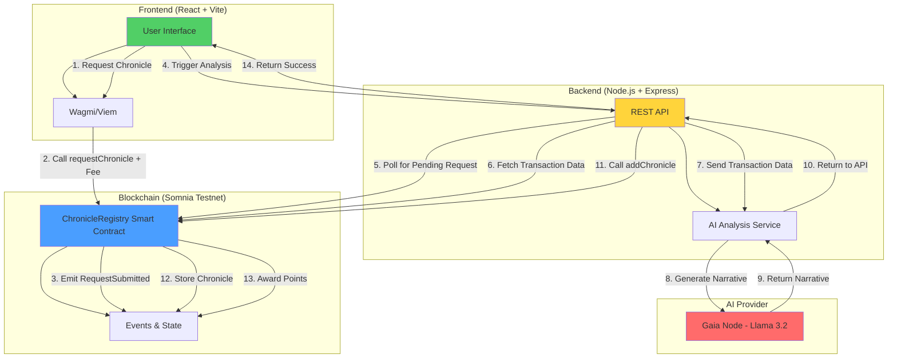

# Chronicle AI 🤖📝

Transform blockchain transactions into human-readable narratives using AI.

**Live Contract**: [`0x41B20e82DBFDe8557363Ca0B7C232C7288EA3Aae`](https://shannon-explorer.somnia.network/address/0x41B20e82DBFDe8557363Ca0B7C232C7288EA3Aae) on Somnia Shannon Testnet

---

## 🎯 What is Chronicle AI?

Chronicle AI is a **decentralized AI-powered blockchain analysis platform** that converts raw transaction data into engaging, educational narratives. By combining smart contracts, AI agents, and a gamified user interface, it makes blockchain transparency accessible to everyone.

### Key Features

- **🤖 AI-Powered Analysis**: Uses Gaia's Llama-3.2-3B-Instruct model to generate educational transaction summaries
- **⛓️ On-Chain Storage**: All chronicles are permanently stored on the Somnia blockchain
- **🏆 Gamification**: Users earn points for submitting transactions and providing feedback
- **📊 Leaderboard**: Track top contributors in the community
- **🔍 Browse All Chronicles**: Explore every transaction that has been analyzed
- **💰 Pay-per-Use**: Simple fee structure (0.001 STT per analysis)

---

## 🏗️ Architecture



---

## 🚀 How It Works

### User Flow

1. **Connect Wallet**: User connects their Web3 wallet (MetaMask, etc.)
2. **Submit Transaction Hash**: Enter any Somnia testnet transaction hash
3. **Pay Fee**: Pay 0.001 STT to request an AI analysis
4. **AI Analysis**: Backend fetches transaction data and generates a narrative using Gaia AI
5. **On-Chain Storage**: Chronicle is stored permanently on the blockchain
6. **Earn Points**: User receives 10 points for submitting a transaction
7. **Provide Feedback**: Users can like/dislike chronicles (1 point per feedback)

### Smart Contract Workflow

```solidity
// User submits request
requestChronicle(txHash) payable

// AI Agent analyzes and stores
addChronicle(txHash, narrative)

// Users provide feedback
giveFeedback(txHash, feedbackType)
```

---

## 🛠️ Tech Stack

### Frontend
- **React 18** with TypeScript
- **Vite** for blazing-fast builds
- **Wagmi** & **Viem** for Web3 interactions
- **ConnectKit** for wallet connectivity
- **Mantine UI** for components
- **Somnia Shannon Testnet** integration

### Backend
- **Node.js** & **Express**
- **TypeScript**
- **ethers.js** for blockchain interactions
- **Gaia Node** for AI inference (Llama-3.2-3B-Instruct)

### Smart Contract
- **Solidity 0.8.20**
- **OpenZeppelin** contracts (Ownable, ReentrancyGuard)
- **Events** for indexing and transparency

---

## 📦 Installation & Setup

### Prerequisites
- Node.js 18+
- npm or yarn
- MetaMask or Web3 wallet
- Somnia testnet STT tokens

### Clone & Install

```bash
# Clone the repository
git clone https://github.com/yourusername/onchain-chronicler.git
cd onchain-chronicler

# Install dependencies
npm install

# Install frontend dependencies
cd frontend && npm install && cd ..

# Install backend dependencies
cd server && npm install && cd ..
```

### Environment Variables

**Frontend** (`.env.local`):
```env
VITE_CONTRACT_ADDRESS="0x41B20e82DBFDe8557363Ca0B7C232C7288EA3Aae"
VITE_WALLETCONNECT_PROJECT_ID="your_project_id"
VITE_API_BASE_URL="http://localhost:3003"
```

**Backend** (`.env`):
```env
PORT=3003
SOMNIA_RPC_URL=https://dream-rpc.somnia.network/
AI_AGENT_PRIVATE_KEY=your_agent_private_key
CONTRACT_ADDRESS=0x41B20e82DBFDe8557363Ca0B7C232C7288EA3Aae

# Gaia Node Details
GAIA_NODE_URL=https://llama.gaia.domains/v1
GAIA_API_KEY=your_gaia_api_key
GAIA_MODEL_NAME=Llama-3.2-3B-Instruct
```

### Run the Application

```bash
# From root directory
npm run dev
```

This starts both frontend (port 5173) and backend (port 3003) concurrently.

---

## 📖 Smart Contract Details

**Contract Address**: `0x41B20e82DBFDe8557363Ca0B7C232C7288EA3Aae`

**Network**: Somnia Shannon Testnet
- **RPC**: https://dream-rpc.somnia.network/
- **Explorer**: https://shannon-explorer.somnia.network

### Key Functions

```solidity
// Request a chronicle (payable)
function requestChronicle(bytes32 _txHash) external payable

// AI agent adds chronicle
function addChronicle(bytes32 _txHash, string calldata _narrative) external

// Provide feedback
function giveFeedback(bytes32 _txHash, Feedback _feedbackType) external

// Cancel pending request
function cancelRequest(bytes32 _txHash) external
```

### Events

```solidity
event RequestSubmitted(address indexed user, bytes32 indexed txHash, uint256 feePaid)
event ChronicleAdded(bytes32 indexed txHash, address indexed requester, string narrative)
event FeedbackGiven(address indexed user, bytes32 indexed txHash, Feedback feedbackType)
```

---

## 🎮 Gamification & Points

### How to Earn Points

| Action | Points |
|--------|--------|
| Submit a transaction for analysis | **10 points** |
| Provide feedback (like/dislike) | **1 point** |

### Leaderboard

The leaderboard displays the top 10 contributors based on total points earned. Compete with others to become the top chronicler!

---

## 🔮 Vision & Next Steps

### Phase 2: Enhanced AI Features
- **Multi-Model Support**: Integrate GPT-4, Claude, or other models for comparison
- **Sentiment Analysis**: Analyze transaction sentiment (positive, negative, neutral)
- **Smart Contract Interaction Decoding**: Explain what contract functions were called
- **NFT & Token Transfer Insights**: Special narratives for NFT mints/transfers

### Phase 3: Community Features
- **Comments & Discussions**: Allow users to discuss chronicles
- **Chronicle Voting**: Upvote the best narratives
- **User Profiles**: Showcase your analysis history and badges
- **Chronicle Collections**: Create themed collections of related transactions

### Phase 4: Advanced Analytics
- **Wallet Analytics**: Analyze entire wallet transaction history
- **Pattern Detection**: Identify common transaction patterns
- **Risk Scoring**: Flag potentially suspicious transactions
- **Visualization Tools**: Charts and graphs for transaction flows

### Phase 5: Multichain Expansion
- **Ethereum Mainnet & L2s**: Expand to Optimism, Arbitrum, Base
- **Cross-Chain Analysis**: Compare similar transactions across chains
- **Chain-Specific Insights**: Tailored narratives for each blockchain

### Phase 6: Monetization & Sustainability
- **Premium Features**: Advanced analytics for subscribers
- **API Access**: Paid API for developers
- **NFT Chronicles**: Mint special analyses as NFTs
- **DAO Governance**: Community-driven feature development

---

## 🤝 Contributing

Contributions are welcome! Here's how you can help:

1. **Fork the repository**
2. **Create a feature branch**: `git checkout -b feature/amazing-feature`
3. **Commit your changes**: `git commit -m 'Add amazing feature'`
4. **Push to the branch**: `git push origin feature/amazing-feature`
5. **Open a Pull Request**

### Areas for Contribution

- 🐛 Bug fixes and improvements
- ✨ New features from the roadmap
- 📝 Documentation improvements
- 🎨 UI/UX enhancements
- 🧪 Test coverage
- 🌐 Multichain support